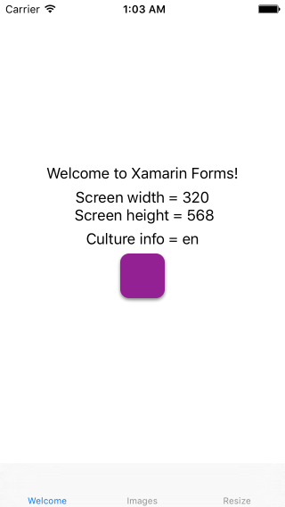

Uniforms
========

The missing helpers library for awesome [Xamarin Forms](https://www.xamarin.com/forms)!

Why
---

There are [Xamarin-Forms-Labs](https://github.com/XLabs/Xamarin-Forms-Labs) and [Xamarin.Plugins](https://github.com/jamesmontemagno/Xamarin.Plugins) projects and probably some more but still some basic things are just missing out of box.

So, we'll try to keep simple things simple and fill some gaps. Stay tuned! :)

Install
-------

`Uniforms.Misc` package is available via NuGet:  
https://www.nuget.org/packages/Uniforms.Misc/

Alternitavely, you may just clone this repo and references to your projects.

Usage
-----

See example in `CoreSample` project:
https://github.com/TheUniforms/Uniforms-Misc/blob/master/CoreSample/CoreSample.cs#L20


1. Init utilities right after `Forms.Init()`:


    On **Android**:

    ```csharp
    Xamarin.Forms.Forms.Init(context, bundle);
    Uniforms.Misc.Droid.ScreenUtils.Init ();
    Uniforms.Misc.Droid.ImageUtils.Init ();
    Uniforms.Misc.Droid.TextUtils.Init ();
    ```

    On **iOS**:

    ```csharp
    Xamarin.Forms.Forms.Init();
    Uniforms.Misc.iOS.ScreenUtils.Init ();
    Uniforms.Misc.iOS.ImageUtils.Init ();
    Uniforms.Misc.iOS.KeyboardUtils.Init ();
    Uniforms.Misc.iOS.TextUtils.Init ();
    ```

2. Then use `Uniforms.Misc.*` in your cross-platform code!

Quick reference
---------------

Utils interface is provided via static classes:

- `Uniforms.Misc.ScreenUtils`
- `Uniforms.Misc.ImageUtils`
- `Uniforms.Misc.KeyboardUtils`
- `Uniforms.Misc.TextUtils`

## Get screen size

```csharp
var screenSize = Uniforms.Misc.ScreenUtils.ScreenSize;
```

## Handle keyboard change events

```csharp
Uniforms.Misc.KeyboardUtils.KeyboardHeightChanged += (height) => {
    Debug.WriteLine ($"KeyboardHeightChanged: {height}");
};
```

## Get image size by file name

```csharp
var imageSize = Uniforms.Misc.ImageUtils.GetImageSize("Graphics/icon.png");
```

## Rounded box view

```csharp
var box = new RoundedBox {
    HeightRequest = 50,
    WidthRequest = 50,
    BackgroundColor = Color.Purple,
    CornerRadius = 10,
    ShadowOffset = new Size(0, 2.0),
    ShadowOpacity = 0.5,
    ShadowRadius = 2.0,
};
```


